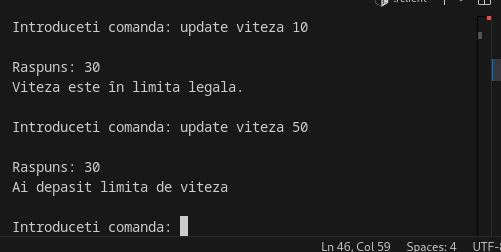

# Traffic Management (C Client-Server + MySQL)

## Description

Traffic Management is a client-server application written in C that monitors and manages vehicle traffic. It provides features for drivers, speed updates, accident reporting, extra options, and street information, all powered by a MySQL database.

For more concrete details check this pdf. 
 

## Technologies Used

- **C** (POSIX Threads, TCP/IP Sockets)
- **MySQL** (`libmysqlclient-dev`)
- **Linux**

## Project Structure

```
traffic-management/
├── server.c
├── client.c
├── baza_date.sql
├── README.md
```

## Setup & Running

### 1. Install Dependencies

```bash
sudo apt update
sudo apt install build-essential libmysqlclient-dev mysql-server
```

### 2. Create and Populate the Database

1. Start MySQL:
   ```bash
   sudo service mysql start
   ```
2. Log into MySQL as root:
   ```bash
   mysql -u root -p
   ```
3. Run the contents of `baza_date.sql`:
   - Copy and paste the contents into the MySQL console
   - Or, from terminal:
     ```bash
     mysql -u root -p < baza_date.sql
     ```

> **Note:**  
> The username and password used in the code are: `root` / `parola_noua`.  
> If you use a different password, update it in the server code in the `init_mysql_connection` function.

### 3. Compile the Code

```bash
gcc server.c -o server -lpthread -lmysqlclient
gcc client.c -o client -lpthread
```

### 4. Start the Server

```bash
./server <number_of_threads>
```
Example:
```bash
./server 4
```
The server listens on **port 2909**.

### 5. Start the Client

```bash
./client <server_address> <port>
```
Example:
```bash
./client 127.0.0.1 2909
```

## Usage

- When starting the client, enter the **driver name** (from the list in the database).
- After authentication, you can send commands such as:
  - `schimb pe strada: <street_name>`
  - `bifez optiuni extra: vreme evenimente preturi`
  - `vrea informatii despre vreme`
  - `raporteaza accident: <street_name>`
  - `update viteza <value>`
  - `debifare optiuni`
- You will receive real-time responses and notifications from the server.

## SQL File (`baza_date.sql`)

This file creates and populates the database with the necessary tables and initial data.


Now I will attach some pictures of the running:

1. Run and enter username (from database)
2. The speed change command tells it whether it has exceeded the speed limit or not.
3. When a user reports an accident, a notification will be sent to all users.
4. Every 1 minute, a notification is sent to all online users about their speed, on which street, and if they have exceeded the speed limit.1[Notification](docs/Frecventa1min.png)

## Recommendations

- For local testing, run both server and client on the same machine using `127.0.0.1`.
- You can add or modify drivers/streets directly in MySQL.
- If you need help extending functionalities or troubleshooting errors, see the code comments or contact at robertoissues@gmail.com.

## Authors

- RobertoSpy

## License

MIT License
